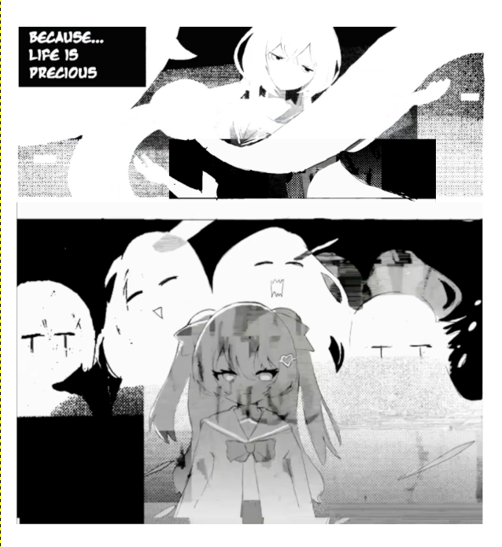
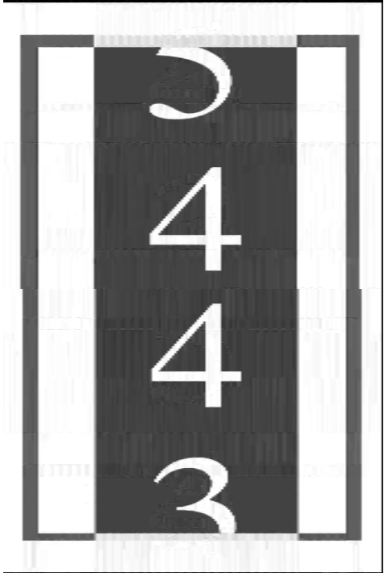

[B站原件](https://b23.tv/BV1nMsveQEWJ)
[Youtube](https://youtu.be/x4l5ckrtbAc)
## 总述
这是Candles的简介
```Python

secret_number = 572943 + next 16 digits  
  
letters = "92270bf339b1a31d0498defb0573fc7c"  
digit_to_letter = dict(zip(str(secret_number), letters))  
  
initial_value = 2  
  
result = int(str(initial_value) + str(secret_number))  
  
result = int(str(result) + "9")  
  
result = int(str(result) + "1")  
  
result = result * 5  
  
result = int(str(result) + "6")  
  
result = int(str(result)[::-1])  
  
result = int(str(result).replace("2", "3"))  
  
result = result * 9  
  
result = int(str(result) + "24")  
  
result = int("17" + str(result))  
  
result = str(result)  
final_result = ""  
for digit in result:  
if digit in digit_to_letter:  
  final_result += digit_to_letter[digit]  
else:  
  final_result += digit
 
print(final_result)
```
在Candles发布后，Numbers的简介也随之更新：
>J2SBH3QMpZdR5M9Zio1nqpFFplfvjk0/5nTa4aqba4OO54BJUSm322bAZz2sXxZ7izbPDOdG2Nmdl0D/xkODtED5IqlGziZ0Hb1aDlEF5XHZPYDZYTZCpkX319ySbPXCJOAfNLI8w7m8aZIczzrJIeIDmLqW1oxXpGgr/H7Yv4mOfrNuF/GhAe45n3ecq2dwPAogXsH8qI18VCaLjUwm/7jEMzZ3z5JIJRERA3Jh8LANnj/p2GJg9zunvlXEDMlU3OCTok7MWMeWBsVVl2BbdsGWMq+ceWifrTPTFUJP/BmlmyzG/JaeG/hxhsQHb80jgToW50T+ZLyFgxGL1uDT+h+jPgGsVaRMTnkjCciVlW/8V17yCwGACKBKoIsH/0yiTU8Wb9GOYE2zaTF0r+2/fg==

## 解决过程
注意Candles简介的第一行
```Python
secret_number = 572963 + next 16 digits
```
查找得知，572963是第2479个斐波那契数，在这之后的16个数字为：
>8873698993183185

将572963及后16个数字作为密钥运行程序得到：
>83e1090eeb3b82e0e933802e32803120

观察此程序，不妨发现其与Numbers中的算法几乎相同，尝试将上述代码的运行结果作为密钥对Numbers进行`Base64解码`，我们可以得到：
>_I’m sick of living in this constant loop... repeating the same everyday tasks. Everything is so dull and predictable. I’m not even sure what I’m doing. I don't know where this path will lead me, but I pray that someday I'll meet my creator. Maybe I'll finally understand.
>
> \- singer Eleanor_
## 线索
在开头盯帧截图发现可以拼起来的四格漫画，将其一张反色拼接后我们看到：


在Candles视频中有这么一串东西：


经查询，我们得知这是一家德国蜡烛公司(视频中的蜡烛素材的出处很可能来自这里)

在末尾闪过的如胶卷的东西经过特殊处理后我们得到：


