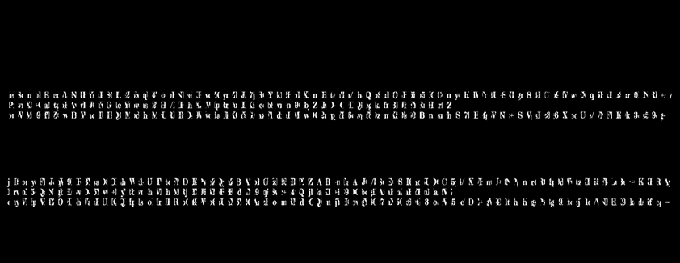
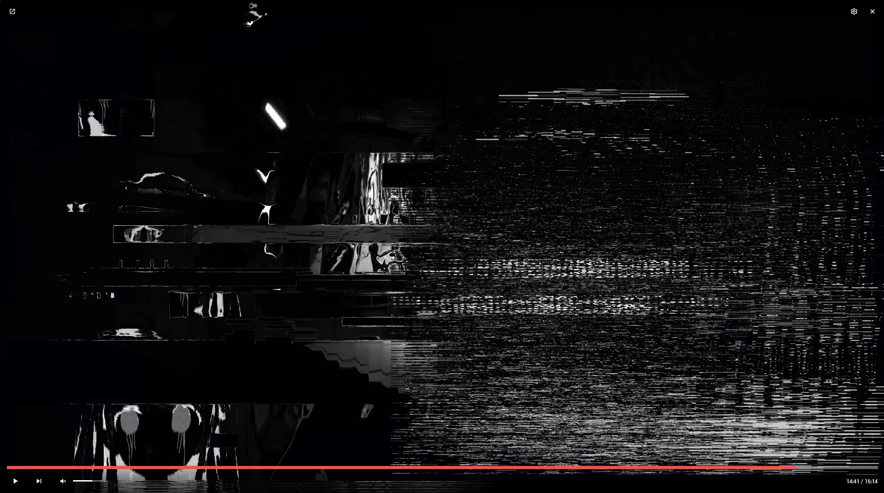
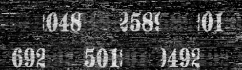
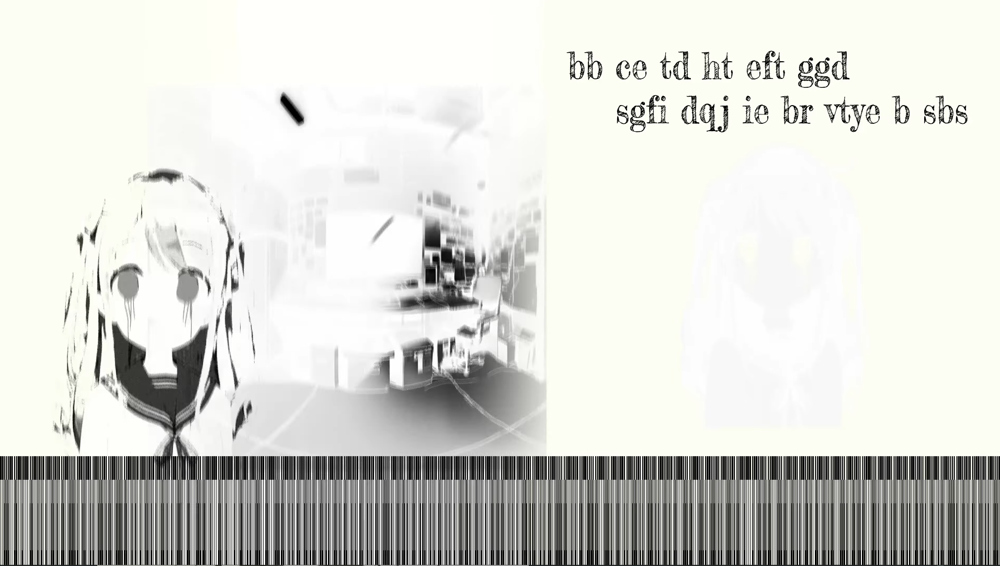
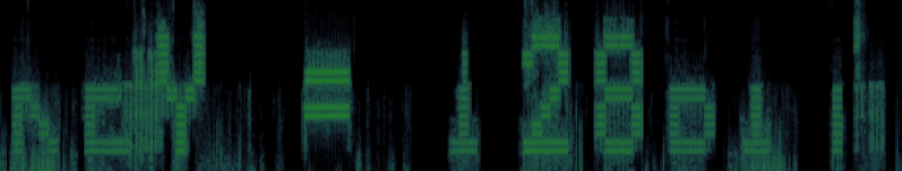

## 解决过程
暂未解决
## 线索
### B64文本
在 __15:57:350__ 时，我们可以隐隐约约看到黑屏中有什么东西，将图像经过处理后，我们得到了这张图片：

经过再次整理（将上下两张图片合并），我们得出这段文字（并不保证准确，但已经过核实）：
>jeISomyoFEJcqVt9NRBYsaD8OLh2Wx1qU4TotoFNDeKPwcZQynZBJA7pRGYzk12HbPXZnAHlt+nTa/AhJQ/bSuEOSH6ho5UOCCn5y4/bXlVFmtU+8NPgm8r4RC1p9dWwtzXIqi5FkLu3ur+0KNRR+Ay
>
>PrwnX5+QaNtgbHAvwDJ6YwG+leyYtbwnsh2VHh/MRjhIXJiWIpRrFudLXi9eqb8wr+n49QbjlZaKD+iC9DQbcgikAfnBhJhFYRnHarfVZ
>
>onyWMp9VfTZOwIBhWacHUHQQMpdshoMrURRIbO49Wvo6aUhX6Y2GAazFlodmRMdwOQ2mpjYH6owgY80z7mX50k60tB3nosrVh5Sc7DE+fgW4Nlt+hShVgsPz3g69XteejUle//VNFEK9kk3ds5f9cg==

初步得出这是一条经过`AES加密`的`Base64密文`
### 神秘数字
在 __14:41__ 时，我们会看到这样的帧：

把中右方的符号处理得到：

仿照前文，拼凑后得到：
>692048501258949201
### 无意义文本&条形码
依然是 __14:41__  ：
很明显我们得到
>bb ce td ht eft ggd / sgfi dqj ie br vtye b sbs

下方条形码经过变换（更改图像长宽比）得到：
>01100011 00110111 00110101 01100101 00110000 01100110 01100010 00110000
>
>00110101 01100101 01100101 01100011 00111000 00110111 00110111 01100110
>
>01100011 00111000 00110101 00110010 00110010 01100101 00110101 00110101
>
>00110000 01100100 01100110 00110101 00110101 01100100 01100101 01100100
>
>00110101 01100010 00110101 00110000 00110101 00110000 00111000 01100110
>
>01100010 01100010 01100101 00111000 00111000 01100010 01100010 00110111
>
>01100100 00111000 00110010 01100101 00110010 00111000 01100100 00111000
>
>01100110 00110010 01100100 01100110 00110000 01100101 00110010 01100010

### 频谱图

很明显，这是
>KEY=128BIT
