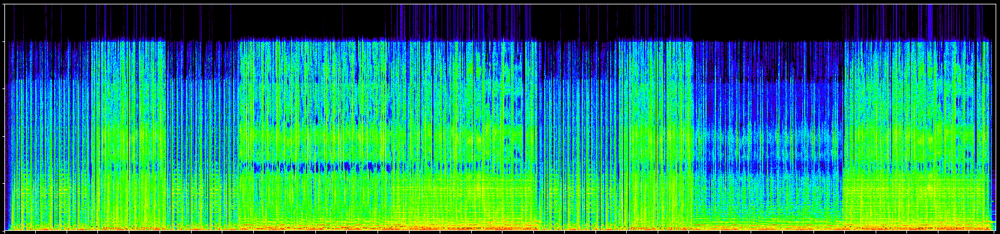
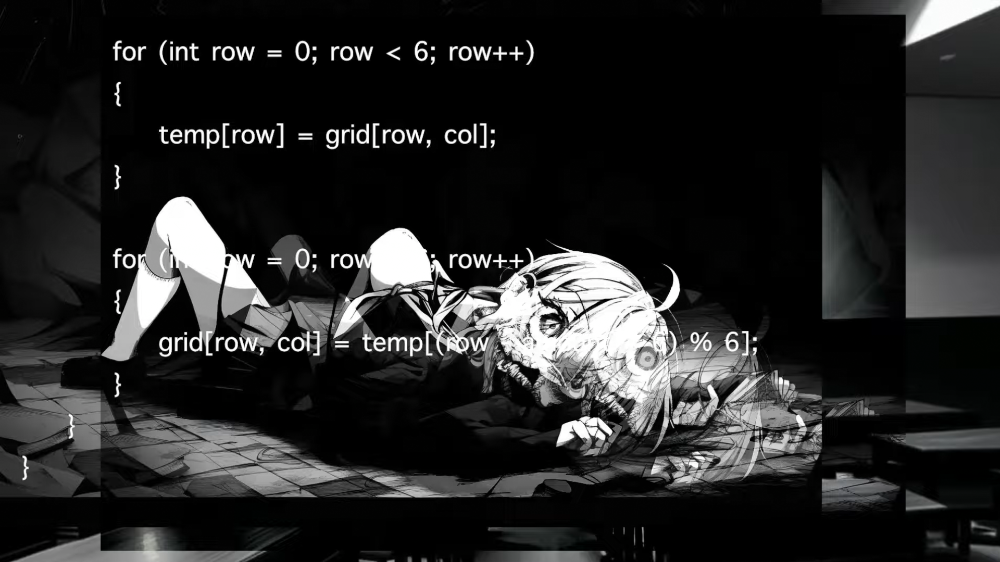

## 总述
这是视频简介（它大概地描述了歌词，但请注意 __最后的密文__）
>Rotate rotate
>All these numbers in my head
>Going round round and round
>145698
>2369
>All these letters in my head
>Counting all these rows again
>145698
>
>185625411245722531628071846912891631276901552167015316621
>
>Rotate rotate
>Running the code
>Left right right left
>Keep me cross the lines
>I don’t even know if there’s a point
>Generating lines just to see what’s the point
>Oh please
>Repeat
>Shift down
>Those lines
>5 4 3 4
>I don’t even know there’s a point…  
>
>__? mggc ob 6n4i h44dhq6 ubag nd1n jmedfs 4hh6jln sdee m4 3joc73t 96 merccke fkpd j90j 68mjqq 8g nd8 h098gddhrm bfln2hkrilblr nidf6547 2d4 fok 5f69cnkrq 7kcqc 5dk22l7a8 jbf7 h4jke8r5 75i3p3i7 ?__

这是视频中出现的字符
>_1:01_ cx68v1
>
>_1:04_ 7jf4b0
>
>_1:07_ zkj1r3
>
>_1:10_ ypqf9u
>
>_1:13_ rgwdhe
>
>_1:16_ ab289c
>
>_1:19_ dkl9uv
>
>_1:22_ mod (ax+b)
>
>---
>_2:13_ qj9zop
>
>_2:16_ 9fg843
>
>_2:19_ msj14r
>
>_2:22_ wiaf9u
>
>_2:25_ ghspcd
>
>_2:28_ bc5lie
>
>_2:31_ nkymxv
>
>_2:35_ .xyz

## 解决过程
暂未解决
## 线索
### 代码
屏幕上会时隐时现出现一段代码的截图，根据辨析，此为`C#`语言，我们目前确定 __需要12个数字__,并不确定是否需要36位的字符串（关于代码的详细情况，我会在另一文档具体说明）
值得注意的是，原文件提供的代码的内置字符串(Alphabet)为
>abcdefghij __q__ lmnopqrstuvwxyz1234567890

将正常语序中的k换成了q
### Hiyori
开头闪现（？）的Hiyori从目前来看，并不像是二进制（其位置无规律并伴随着空帧和都有的帧）
### 频谱图

看不出来什么线索......
## ~~我知道你很急，但你先别急~~
是的，线索在这里就已经终止，下面附一些有趣的帧：

